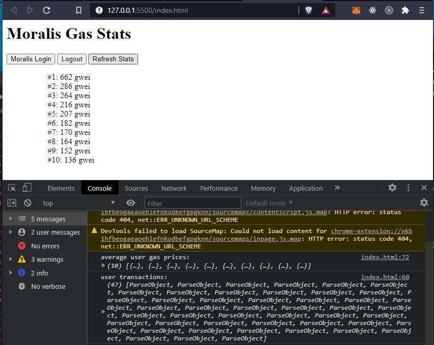

# Build a Simple dApp in 3 Mins - Cloud Functions (Part 5)

## Average Gas Price

To calculate average gas prices for our users, we need to create a cloud function on the Moralis Server and then call that function from our dApp.

### Create Cloud Function

Go to your Moralis Server instance and click the "Cloud Functions" button. Paste in the following code:

```javascript
Moralis.Cloud.define("getAvgGas", async function (request) {
  const query = new Moralis.Query("EthTransactions");
  const pipeline = [
    {
      group: {
        // group by "from_address"
        objectId: "$from_address",
        // add computed property avgGas
        // get average and convert wei to gwei
        avgGas: { $avg: { $divide: ["$gas_price", 1000000000]} },
      },
    },
    { sort: { avgGas: -1 } }, // sort by avgGas high to low
    { limit: 10 }, // only return top 10 results
  ];

  // the master key is required for aggregate queries
  const results = await query.aggregate(pipeline, { useMasterKey: true });
  return results;
})
```

### Calling the Cloud Function

A cloud function can be called with `Moralis.Cloud.run(name, args)` . Our cloud function does not have any arguments so we can leave that blank.

```javascript
async function getAverageGasPrices() {
  const results = await Moralis.Cloud.run("getAvgGas");
  console.log("average user gas prices:", results);
}
```

Modify the `getStats()` function to call `getAverageGasPrices()`.

```javascript
function getStats() {
  const user = Moralis.User.current();
  if (user) {
    getUserTransactions(user);
  }
  getAverageGasPrices();
}
```

After these changes, the results will look something like this:

.PNG>)

### Displaying Gas Price

All that's left is to render the top list on the page. We can do this with a bit of dynamic HTML. First, add an unordered list tag below the buttons.

```markup
<ul id="gas-stats"></ul>
```

Next, create a new function to loop through the cloud query results and add the list items to the list.

```javascript
function renderGasStats(data) {
  const container = document.getElementById("gas-stats");
  container.innerHTML = data
    .map(function (row, rank) {
      return `<li>#${rank + 1}: ${Math.round(row.avgGas)} gwei</li>`;
    })
    .join("");
}
```

Then call the `renderGasStats()` function after getting the results back from the cloud query.

```javascript
async function getAverageGasPrices() {
  const results = await Moralis.Cloud.run("getAvgGas");
  console.log("average user gas prices:", results);

  // ** add this **
  renderGasStats(results);
}
```

## Final Results

The final results will look something like this after several users have logged in. The `Refresh Stats` button can be clicked to update the list.



## Completed Code

`index.html`

```markup
<html>
  <head>
    <!-- Moralis SDK code -->
    <script src="https://cdn.jsdelivr.net/npm/web3@latest/dist/web3.min.js"></script>
    <script src="https://unpkg.com/moralis/dist/moralis.js"></script>
  </head>
  <body>
    <h1>Moralis Gas Stats</h1>

    <button id="btn-login">Moralis Login</button>
    <button id="btn-logout">Logout</button>
    <button id="btn-get-stats">Refresh Stats</button>

    <!-- stats will go here -->
    <ul id="gas-stats"></ul>

    <script>
      // connect to Moralis server
      const serverUrl = "https://9c8nrl6lfq8u.moralis.io:2053/server";
      const appId = "TCDv7lnGwNN7RIhlj30wA69dnaamxtsmqcTnm3ch";
      Moralis.start({ serverUrl, appId });

      // LOG IN WITH METAMASK
      async function login() {
        let user = Moralis.User.current();
        if (!user) {
          user = await Moralis.authenticate();
        }
        console.log("logged in user:", user);
        getStats();
      }

      // LOG OUT
      async function logOut() {
        await Moralis.User.logOut();
        console.log("logged out");
      }

      // bind button click handlers
      document.getElementById("btn-login").onclick = login;
      document.getElementById("btn-logout").onclick = logOut;
      document.getElementById("btn-get-stats").onclick = getStats;

      // refresh stats
      function getStats() {
        const user = Moralis.User.current();
        if (user) {
          getUserTransactions(user);
        }
        getAverageGasPrices();
      }

      // HISTORICAL TRANSACTIONS
      async function getUserTransactions(user) {
        // create query
        const query = new Moralis.Query("EthTransactions");
        query.equalTo("from_address", user.get("ethAddress"));

        // subscribe to query updates
        const subscription = await query.subscribe();
        handleNewTransaction(subscription);

        // run query
        const results = await query.find();
        console.log("user transactions:", results);
      }

      // REAL-TIME TRANSACTIONS
      async function handleNewTransaction(subscription) {
        // log each new transaction
        subscription.on("create", function (data) {
          console.log("new transaction: ", data);
        });
      }

      // CLOUD FUNCTION
      async function getAverageGasPrices() {
        const results = await Moralis.Cloud.run("getAvgGas");
        console.log("average user gas prices:", results);
        renderGasStats(results);
      }

      function renderGasStats(data) {
        const container = document.getElementById("gas-stats");
        container.innerHTML = data
          .map(function (row, rank) {
            return `<li>#${rank + 1}: ${Math.round(row.avgGas)} gwei</li>`;
          })
          .join("");
      }

      //get stats on page load
      getStats();
    </script>
  </body>
</html>

```

On the Moralis Server in the cloud code section:

```javascript
Moralis.Cloud.define("getAvgGas", async function (request) {
  const query = new Moralis.Query("EthTransactions");
  const pipeline = [
    {
      group: {
        // group by "from_address"
        objectId: "$from_address",
        // add computed property avgGas
        // get average and convert wei to gwei
        avgGas: { $avg: { $divide: ["$gas_price", 1000000000]} },
      },
    },
    { sort: { avgGas: -1 } }, // sort by avgGas high to low
    { limit: 10 }, // only return top 10 results
  ];

  // the master key is required for aggregate queries
  const results = await query.aggregate(pipeline, { useMasterKey: true });
  return results;
})
```

## Legendary!

Wow, you finished! Congratulations on building your first Moralis dApp. You are a DeFi legend!

#### 🏁 This is the Finish Line 🏁

Pumped and want more? What's next? Check out all our tutorials on the [Moralis Web3 Youtube channel](https://www.youtube.com/channel/UCgWS9Q3P5AxCWyQLT2kQhBw/featured)! The next guide below called "Deploy and Track ERC20 Events" is a more advanced tutorial so we suggest checking out other "Basics" tutorials on the Youtube channel first, such as "[Learning Solidity Basics](https://www.youtube.com/watch?v=IkCfIE1VoRo\&list=PLFPZ8ai7J-iTJDENUIY40VsU\_5Wmxkr7j)" and "[Moralis Basics](https://www.youtube.com/watch?v=aYi1\_moT4kI\&list=PLFPZ8ai7J-iQ7AruWqKOLUHQqabeSm37I)."
