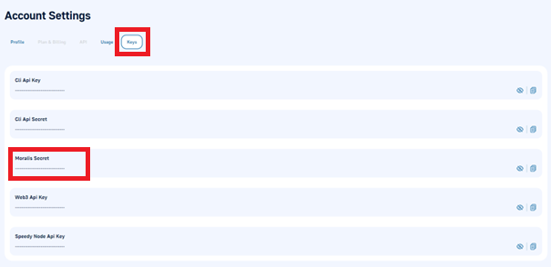
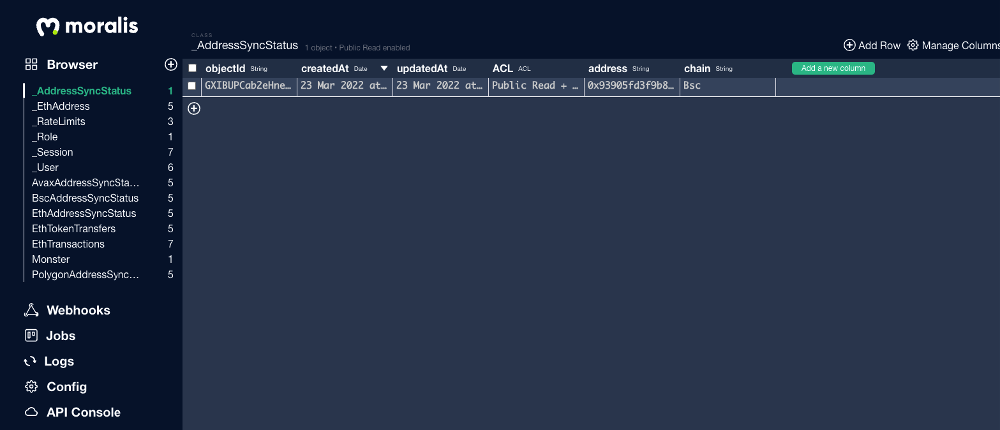

# 🖨 Connect with Node.js

### Installing Moralis SDK

Run the following command to install Moralis SDK




```shell
npm install moralis
```





```shell
yarn add moralis
```




### SDK Initialization

You need to initialize Moralis SDK with the following syntax in node.js:

Create a file `index.ts` and add below code:



```javascript
/* import moralis */
const Moralis = require("moralis/node");

/* Moralis init code */
const serverUrl = "YOUR-SERVER-URL";
const appId = "YOUR-APP-ID";
const masterKey = "YOUR-MASTER-KEY";

await Moralis.start({ serverUrl, appId, masterKey });
```



with `masterKey` you can directly access the Moralis dashboard without the need for authentication.


**Note:** With the master key you can use the API, RPC nodes and other features of your Moralis account using the SDK straight from your backend.



Please remember to never leak your master key because once someone gets your master key they will have full access to your Moralis account.


### DB query

#### Saving data

To save object with data copy-paste the following code:

Create a file `SaveData.ts` and add below code:



```javascript
const SaveData = async () => {
  await Moralis.start({ serverUrl, appId, masterKey });

  const Monster = Moralis.Object.extend("Monster");
  const monster = new Monster();

  monster.set("strength", 1024);
  monster.set("ownerName", "Aegon");
  monster.set("canFly", true);

  await monster.save();
};

SaveData();
```



Run the following command in your terminal:

```
ts-node SaveData.ts
```

Go to your Moralis dashboard and you will see the data saved in the database:


#### Query

Create a file `FindQuery.ts` and add below code:



```javascript
const FindQuery = async () => {
  const Monster = Moralis.Object.extend("Monster");
  const query = new Moralis.Query("Monster");

  const results = await query.find();
  console.log(results);
};
```



Run:

```
ts-node FindQuery.ts
```

In your console you will see:

```
[
  ParseObjectSubclass {
    className: 'Monster',
    _objCount: 0,
    id: 'I3tbPplP8T531e0vgBrFVj5O'
  }
]
```

For more info on DB Queries click [here](https://docs.moralis.io/moralis-dapp/database/queries)

### Live Query

Subscribing to Queries to Get Real-Time Alerts Whenever Data in the Query Result Set Changes.

Create a file `LiveQuery.ts` add the following code in your file:



```javascript
const LiveQuery = async () => {
  const Monster = Moralis.Object.extend("Monster");
  const query = new Moralis.Query(Monster);

  let subscription = await query.subscribe();
  console.lIog(subscription);
};

LiveQuery();
```



Run:

```
ts-node LiveQuery.ts
```

In your console you will see:

```
Subscription {
  _events: [Object: null prototype] { error: [Function (anonymous)] },
  _eventsCount: 1,
  _maxListeners: undefined,
  id: 1,
  query: ParseQuery {
    className: 'Monster',
    _where: {},
    _include: [],
    _exclude: [],
    _select: undefined,
    _limit: -1,
    _skip: 0,
    _count: false,
    _order: undefined,
    _readPreference: null,
    _includeReadPreference: null,
    _subqueryReadPreference: null,
    _queriesLocalDatastore: false,
    _localDatastorePinName: null,
    _extraOptions: {},
    _hint: undefined,
    _explain: undefined,
    _xhrRequest: { task: null, onchange: [Function: onchange] }
  },
  sessionToken: undefined,
  subscribePromise: Promise {
    undefined,
    resolve: [Function (anonymous)],
    reject: [Function (anonymous)]
  },
  subscribed: true,
  [Symbol(kCapture)]: false
}
```

For more info on Live Queries click [here](https://docs.moralis.io/moralis-dapp/database/live-queries)

### Web3API use

Create a file `Web3API.ts` and add the below code:



```javascript
const serverUrl = "YOUR-SERVER-URL";
const appId = "YOUR-APP-ID";
const moralisSecret = "YOUR MORALIS SECRET";

const web3API = async () => {
  await Moralis.start({ serverUrl, appId, moralisSecret });

  const price = await Moralis.Web3API.token.getTokenPrice({
    address: "0xe9e7cea3dedca5984780bafc599bd69add087d56",
    chain: "bsc",
  });
  console.log(price);
};

web3API();
```



with `moralisSecret` all API calls go directly to the API instead of passing through the Moralis Server.

To get `moralisSecret` you need to go to account settings as shown in image below


then API and copy your `moralisSecret` key



Run:

```
ts-node Web3API.ts
```

You will see the following result:

```
{
  nativePrice: {
    value: '2492486316397403',
    decimals: 18,
    name: 'Binance Coin',
    symbol: 'BNB'
  },
  usdPrice: 1.000879782388469,
  exchangeAddress: '0xcA143Ce32Fe78f1f7019d7d551a6402fC5350c73',
  exchangeName: 'PancakeSwap v2'
}
```

### Enable Moralis with Private key


Currently this doesn't work on free plan due to Speedy Nodes removal


#### `Moralis.Transfer`

We can transfer using a private key in the backend any `'native' | 'erc20' | 'erc721' | 'erc1155'` tokens.

Create a file `tranx.ts` and add below code:



```javascript
const tranx = async () => {
  await Moralis.start({ serverUrl, appId, moralisSecret });

  // Enable web3
  await Moralis.enableWeb3({
    //BSC mainnet
    chainId: 0x38,
    privateKey: "YOUR-PRIVATE KEY",
  });

  // sending 0.5 DAI tokens with 18 decimals on BSC mainnet
  const options: Moralis.TransferOptions = {
    type: "erc20",
    amount: Moralis.Units.Token("0.5", 18),
    receiver: "0x93905fd3f9b8732015f2b3Ca6c16Cbcb60ECf895",
    contractAddress: "0x1AF3F329e8BE154074D8769D1FFa4eE058B1DBc3",
  };
  await Moralis.transfer(options).then((result) => {
    console.log(result);
  });
};

tranx();
```



with `moralisSecret` all API calls go directly to the API instead of passing through the Moralis Server.


**Note**: Private key should never be exposed to front-end or browser or on cloud or else will result in loss of funds


Run:

```
ts-node tranx.ts
```

You will see the `result` in your terminal:

```
{
  nonce: 9,
  gasPrice: BigNumber { _hex: '0x012a05f200', _isBigNumber: true },
  gasLimit: BigNumber { _hex: '0x8d07', _isBigNumber: true },
  to: '0x1AF3F329e8BE154074D8769D1FFa4eE058B1DBc3',
  value: BigNumber { _hex: '0x00', _isBigNumber: true },
  data: '0xa9059cbb00000000000000000000000093905fd3f9b8732015f2b3ca6c16cbcb60ecf89500000000000000000000000000000000000000000000000006f05b59d3b20000',
  chainId: 56,
  v: 147,
  r: '0x2715e0d05fdf82f7e129c1d0608de4629d15fffa557d43339d78489d80f78a0f',
  s: '0x12ab674095e18b1e81525e30826b55ebcc24cddfceed855c26819aafdd4f78d3',
  from: '0x7094F8B1a2a1EeA360D79Be99bAeF18175aa30Ca',
  hash: '0xc53417f3f584680ad81046195c64edf59f8a2eb6826793765676ebe304f74760',
  type: null,
  confirmations: 0,
  wait: [Function (anonymous)]
}
```

#### `Moralis.executeFunction`

Create a file `execute.ts` and add below code:



```javascript
const execute = async () => {
  await Moralis.start({ serverUrl, appId, moralisSecret });

  // Enable web3
  await Moralis.enableWeb3({
    chainId: 0x1,
    privateKey:
      "afcf6a8d1a2b9e20bd322850afb28085693f436427fe8da3d0e40954cfb2d0dc",
  });

  const options = {
    // CAPSULE contract
    contractAddress: "0xfcb1315c4273954f74cb16d5b663dbf479eec62e",
    // calling tokenURI function
    functionName: "tokenURI",
    // contract ABI
    abi: [
      {
        inputs: [{ internalType: "uint256", name: "tokenId", type: "uint256" }],
        name: "tokenURI",
        outputs: [{ internalType: "string", name: "", type: "string" }],
        stateMutability: "view",
        type: "function",
      },
    ],
    // token URI of token ID 700
    params: { tokenId: 700 },
  };
  await Moralis.executeFunction(options).then((result) => {
    console.log(result);
  });
};

execute();
```



with `moralisSecret` all API calls go directly to the API instead of passing through the Moralis Server.

Run:

```
ts-node execute.ts
```

You will see the `result` in your terminal:

```
https://hatch.capsulehouse.io/api/metadata/700
```

For more info on `executeFunction` check [here](https://docs.moralis.io/moralis-dapp/web3/web3#executefunction)

### Add New Address Sync From Code

The `Sync and Watch Address` plugin calls a Cloud Function called watchXxxAddressunder the hood, where "Xxx" are the chain names [here](https://docs.moralis.io/moralis-dapp/automatic-transaction-sync/historical-transactions#chain-prefixes). These cloud functions can also be called directly from your own code!

Create a file `watchAddr.ts` and add below code:



```javascript
const watchAddr = async () => {
  await Moralis.start({ serverUrl, appId, masterKey });

  await Moralis.Cloud.run(
    "watchBscAddress",
    { address: "0x..." },
    { useMasterKey: true }
  ).then((result) => {
    console.log(result);
  });
};

watchAddr();
```



Run:

```
ts-node watchAddr.ts
```

in Terminal you will see:

```
{ status: 200, data: { success: true, result: true } }
```

The transaction data is stored in Moralis Dashboard:



By default, only new transactions made by addresses being watched by using this cloud function will be added to the database. If you also want to add historical data for addresses that you want to watch, you can add `sync_historical:true`

Note: The watch address functions return no value as they start a job. They are still asynchronous though! Once the promise returns the synced transactions, they should be in the XxxTransactions table for the corresponding chain.

### Add New Event Sync From Code

#### Watch new smart contract event

Moralis Server has a special cloud function called `watchContractEvent(options)`. You can call it using the master key.

Note: at the moment the events created via code won't be seen in the admin UI, you can only see them in the database, we are working on connecting the admin UI properly

Create a file `watchEvent.ts` and add below code:



```javascript
const watchEvent = async () => {
  await Moralis.start({ serverUrl, appId, masterKey });
  // code example of creating a sync event from cloud code
  let options = {
    chainId: "42",
    // UniswapV2Factory contract
    address: "0x5c69bee701ef814a2b6a3edd4b1652cb9cc5aa6f",
    topic: "PairCreated(address, address, address, uint256)",
    abi: {
      anonymous: false,
      inputs: [
        {
          indexed: true,
          internalType: "address",
          name: "token0",
          type: "address",
        },
        {
          indexed: true,
          internalType: "address",
          name: "token1",
          type: "address",
        },
        {
          indexed: false,
          internalType: "address",
          name: "pair",
          type: "address",
        },
        {
          indexed: false,
          internalType: "uint256",
          name: "test",
          type: "uint256",
        },
      ],
      name: "PairCreated",
      type: "event",
    },
    limit: 500000,
    tableName: "UniPairCreated",
    sync_historical: false,
  };

  Moralis.Cloud.run("watchContractEvent", options, { useMasterKey: true }).then(
    (result) => {
      console.log(result);
    }
  );
};

watchEvent();
```



Run:

```
ts-node watchEvent.ts
```

In the terminal you will see:

```
{ success: true }
```


<mark style="color:green;">The Event data is succesfully stored in Moralis Dashboard</mark>



