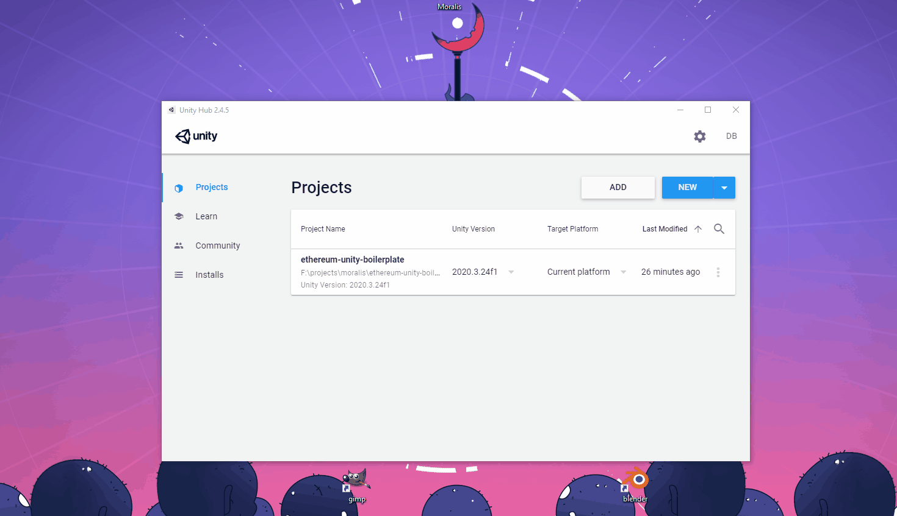
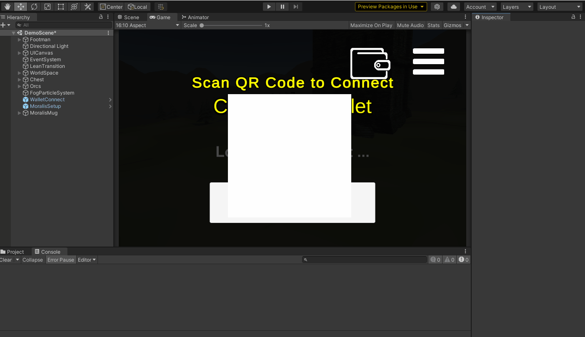
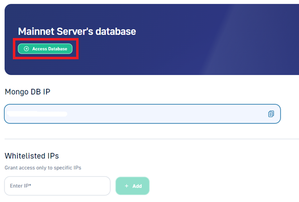

# 🎮 Connect with Unity

### Unity SDK breaking updates



- New unity sdk version has been published which feature some major updates and breaking changes, take a look at the [changelog here](https://github.com/MoralisWeb3/unity-web3-game-kit/releases/tag/v1.2.0)
- The code snippets in the docs has been updated to use the latest version of the sdk with the new code syntax (most recommended)
- You can take a look at this well presented [migration video](https://cdn.discordapp.com/attachments/918645175562145822/978328925753208904/MigrateToV120.mp4)
- This also mean some of the moralis projects, github examples, youtube tutorials e.t.c created before the release may be using the old sdk if not updated and may cause some confusing or conflicts (when looking at the docs), you are advised to migrate by following the migration video above
- This chapter has been split to show the various installation and setup for the different sdk versions [ < v1.2.0 or >= v1.2.0]
- Further questions feel free to ask on our [forum (uinty thread)](https://forum.moralis.io/t/ethereum-unity3d-boilerplate-questions/4553/708) or ask in our [discord server](https://moralis.io/mage/)
  

### Web3 Unity Boilerplate

- The Unity Boilerplate include C# Moralis SDK and has an example Unity scene allowing you to login your users via their wallets, read their tokens and NFTs, interact with smart contracts and much more.


Web3 Unity Boilerplate


### Adding Moralis to Your Unity Game

#### Downloading the SDK

Download the latest version of the SDK [here](https://github.com/ethereum-boilerplate/web3-unity-boilerplate) Then navigate to the releases and select the lastest version of the sdk. download it as a unity package

#### Creating a unity project

- Create a new Unity project with Unity HUB, you can select any template of your choice, add a name to your project and a location.
- When the project is created, navigate to the folder you downloaded the package, drag and drop the package into the Assets folder in unity, an importing menu will popup and then click import to import the package into your project.



**Configuring the project**

- In your unity project, open MoralisWeb3ApiSdk->Example folder and double-click on the DemoScene to lauch it in the scene view.
- In the "Hierachy" panel under DemoScene click on the "MoralisSetup" gameobject, if the attached script sub-section is not expanded, expand it, also do the same with the "WalletConnect" gameobject, take a look at this script and explore their code and the varibales they links with.
- Using the information from your Moralis Server, fill in Application Id, and Server URL on the "MoralisController" script attached to the "MoralisSetup".

**For WEBGL**

- In Player Settings change the WebGL template to the Moralis WebGL Template.

**Running the application**

- Run the application by clicking the Play icon located at the top, center of the Unity.
- Click on the "Authenticate" button to authenticate to Moralis using your Wallet.
- Explore the demoscene.


Webgl can only be tested on build




**Setup Wizard**

- you will be presented with the setup wizard to input your Dapp URL and Dapp ID

**For WEBGL**

- Copy the `WebGLTemplates` folder from `Packages/io.moralis.web3-unity-sdk/Resources/` to the Assets folder
- In Player Settings change the WebGL template to the Moralis WebGL Template.

* Copy the `WebGLTemplates` folder from `Packages/io.moralis.web3-unity-sdk/Resources/` to the Assets folder
* In Player Settings change the WebGL template to the Moralis WebGL Template.

- Open the Demos folder in the Moralis Web3 Unity SDK/
- Navigate to and open the Introduction scene in Introduction/
- Run the application/scene by clicking the Play icon located at the top, center of the Unity.


If the above did not work, you can copy and paste the Demos/ folder in the Assets folder and run it from there


**Running the application**

- Open the DemoScene in the Examples
- Run the application by clicking the Play icon located at the top, center of the Unity.
  
  

#### See all User Assets in the Moralis Database

As soon as the user logs in Moralis fetches all the on-chain data about that user from all chains and puts it into the Moralis Database. To see the Moralis Database go your server settings into the _Database_ tab.

 

You will see the database of that server once you click _Access Database_. Moralis fetches data from all blockchain where the address of the user has been active and you can see and query all tokens, NFTs and past transactions of the user all in one database.

### Tutorial guides


These example videos/tutorials were made with the sdk version < 1.2.0, some of the code may not work for version >= 1.2.0, take a look at the [changelog](https://github.com/ethereum-boilerplate/web3-unity-boilerplate/releases/tag/v1.2.0) and [download migration video](https://cdn.discordapp.com/attachments/918645175562145822/978328925753208904/MigrateToV120.mp4)


Guides on how to use the moralis unity sdk in unity on various platform.

Authentication using the Moralis Authentication Kit



Unity Web3 for Beginners - Smart Contract Interaction, Solidity, Hardhat, Moralis, C#, WebGL

