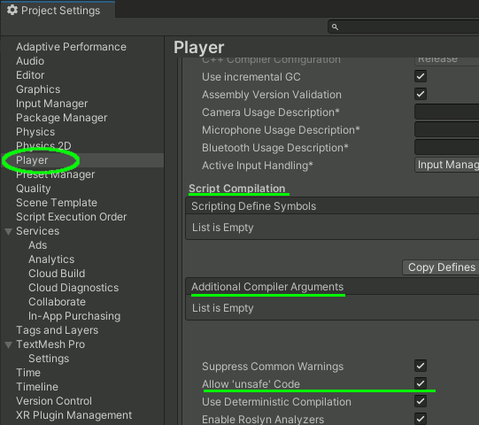

# 🎮 Connect with Unity

### Web3 Unity Boilerplate

- The Unity Boilerplate include C# Moralis SDK and has an example Unity scene allowing you to login your users via their wallets, read their tokens and NFTs, interact with smart contracts and much more.


Web3 Unity Boilerplate


### Adding Moralis to Your Unity Game




#### Downloading the SDK

Downlaod the latest version of the SDK [here](https://github.com/ethereum-boilerplate/web3-unity-boilerplate) Then navigate to the releases and select the lastest version of the sdk. downlaod it as a unity package

#### Creating a unity project

- Create a new Unity project with Unity HUB, you can select any template of your choice, add a name to your project and a location.
- When the project is created, navigate to the folder you downloaded the package, drag and drop the package into the Assets folder in unity, an importing menu will popup and then click import to import the package into your project.

> NOTE: If after importing but before running the package, you see an error that describes something as "unsafe", it is probably due to a block of code in Nethereum SCrypt.cs. Open Build Settings -> Player Settings, scroll a bit to the bottom and check "Allow unsafe Code".

#### Configuring the project

- In your unity project, open MoralisWeb3ApiSdk->Example folder and double-click on the DemoScene to lauch it in the scene view.
- In the "Hierachy" panel under DemoScene click on the "MoralisSetup" gameobject, if the attached script sub-section is not expanded, expand it, also do the same with the "WalletConnect" gameobject, take a look at this script and explore their code and the varibales they links with.
- Using the information from your Moralis Server, fill in Application Id, and Server URL on the "MoralisController" script attached to the "MoralisSetup".

**For WEBGL**

- In Player Settings change the WebGL template to the Moralis WebGL Template.

#### Running the application

- Run the application by clicking the Play icon located at the top, center of the Unity.
- Click on the "Authenticate" button to authenticate to Moralis using your Wallet.
- Explore the demoscene.

> **Warning**
>
> Webgl can only be tested on build

 


#### Downloading the SDK

Downlaod the latest version of the SDK [here](https://github.com/ethereum-boilerplate/web3-unity-boilerplate) Then navigate to the releases and select the lastest version of the sdk. downlaod it as a unity package

#### Configuring the project

- Create a new Unity project with Unity HUB, you can select any template of your choice, add a name to your project and a location.
- When the project is created, navigate to the folder you downloaded the package, drag and drop the package into the Assets folder in unity, an importing menu will popup and then click import to import the package into your project.
  

#### Setup Wizard

- you will be presented with the setup wizard to input your Dapp URL and Dapp ID
  

#### Running the application

- Open the DemoScene in the Examples
- Run the application by clicking the Play icon located at the top, center of the Unity.
- Be amazed.




#### See all User Assets in the Moralis Database

As soon as the user logs in Moralis fetches all the on-chain data about that user from all chains and puts it into the Moralis Database. To see the Moralis Database go your server and click on _Dashboard_.

You will see the database of that server once you click _Dashboard_. Moralis fetches data from all blockchain where the address of the user has been active and you can see and query all tokens, NFTs and past transactions of the user all in one database.

.png>)

### Tutorial guides

> **Warning**
>
> These example videos/tutorials were made with the sdk version < 1.2.0, some of the code may not work for version >= 1.2.0, take a look at the [changelog](https://github.com/ethereum-boilerplate/web3-unity-boilerplate/releases/tag/v1.2.0) and the [migration video here](https://cdn.discordapp.com/attachments/918645175562145822/978328925753208904/MigrateToV120.mp4)

Guides on how to use the moralis unity sdk in unity on various platform.


Unity WEBGL Metamask Wallet Connection



Multiplayer Web3 game with Unity and Photon

